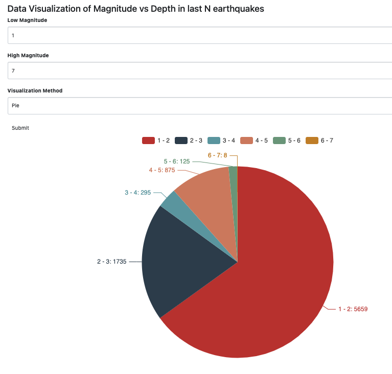
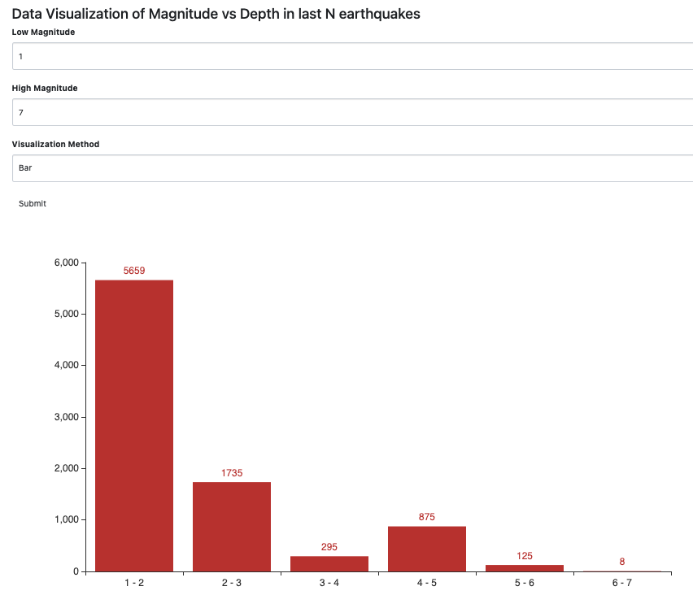
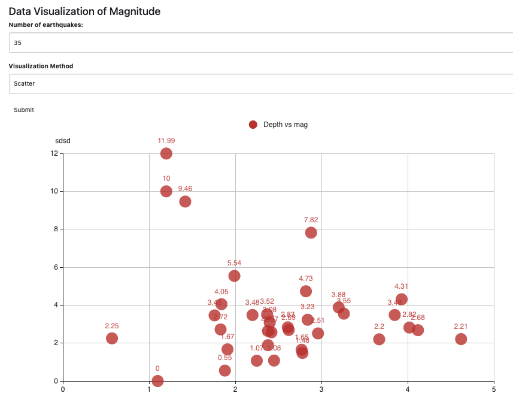

# Data Visualization using flask and pyecharts

- Created a Flask application to display an Earthquake dataset.

- Data is filtered and visualized using a bar, pie and scatter plot.

## Tech Stack

- Python
- Flask
- SQLAlchemy
- Bootstrap
- FlaskForm
- Pyecharts
- Pandas

## Application Screenshots

- Pie Chart

- Bar Chart

- Scatter Plot

